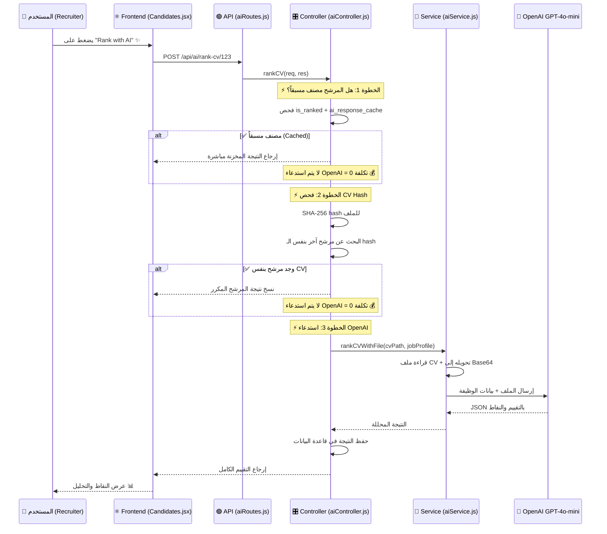

# 🧠 كيف يعمل تصنيف السيرة الذاتية (CV Ranking) بالذكاء الاصطناعي

## 📁 الملفات المسؤولة

| الملف | الدور |
|-------|-------|
| [aiService.js](file:///c:/Users/ayoub/OneDrive/Desktop/HireX/App/HireX/Backend/services/aiService.js) | الخدمة الأساسية — ترسل ملف CV مباشرة إلى OpenAI |
| [aiController.js](file:///c:/Users/ayoub/OneDrive/Desktop/HireX/App/HireX/Backend/controllers/aiController.js) | المتحكم — يدير المنطق والكاش وقاعدة البيانات |
| [aiRoutes.js](file:///c:/Users/ayoub/OneDrive/Desktop/HireX/App/HireX/Backend/routes/aiRoutes.js) | المسارات — `POST /ai/rank-cv/:candidateId` و `POST /ai/rank-all/:projectId` |
| [api/index.js](file:///c:/Users/ayoub/OneDrive/Desktop/HireX/App/HireX/src/api/index.js) | Frontend API — `aiApi.rankCV()` و `aiApi.rankAll()` |
| [Candidates.jsx](file:///c:/Users/ayoub/OneDrive/Desktop/HireX/App/HireX/src/Screens/Pipeline/Candidates.jsx) | صفحة المرشحين — أزرار التصنيف والعرض |

---

## 🔄 مسار التنفيذ الكامل (Flow)



---

## 🔍 شرح كل خطوة بالتفصيل

### الخطوة 1️⃣: المستخدم يضغط على زر التصنيف

في ملف **Candidates.jsx** (سطر 71-79)، عند الضغط على زر "Rank with AI":

```javascript
const handleRankCV = async (candidateId) => {
  setRankingLoading(true);   // إظهار مؤشر التحميل
  try {
    const res = await aiApi.rankCV(candidateId);  // استدعاء API
    setRankingResult(res.data);  // تخزين النتيجة للعرض
    load();  // تحديث الجدول بالنقاط الجديدة
  } catch (err) {
    toast.error('Failed to rank CV');  // إظهار خطأ
  }
};
```

> [!NOTE]
> يوجد أيضاً زر **"Rank All"** يصنف جميع المرشحين غير المصنفين دفعة واحدة (سطر 81-101)

---

### الخطوة 2️⃣: الكنترولر يفحص الكاش (التخزين المؤقت)

في ملف **aiController.js** (سطر 16-114)، الكنترولر يتبع 3 مراحل ذكية لتوفير التكلفة:

#### المرحلة أ: هل المرشح مصنف مسبقاً؟

```javascript
// سطر 28-35
if (cand.is_ranked && cand.ai_response_cache && !forceRerank) {
  // ✅ النتيجة موجودة → إرجاعها مباشرة بدون استدعاء OpenAI
  return res.json({
    ranking: JSON.parse(cand.ai_response_cache),
    cached: true,   // علامة أن النتيجة مخزنة
  });
}
```

#### المرحلة ب: هل يوجد مرشح آخر بنفس الملف؟

```javascript
// سطر 47-83 — يستخدم SHA-256 Hash
const cvHash = crypto.createHash("sha256").update(cvBuffer).digest("hex");

// البحث عن مرشح آخر بنفس الـ hash ونفس الوظيفة
const duplicate = await candidate.findOne({
  where: {
    cv_hash: cvHash,
    fk_profile: cand.fk_profile,  // نفس الوظيفة
    is_ranked: true,
    id: { [Op.ne]: candidateId },  // ليس نفس المرشح
  },
});
```

> [!TIP]
> هذا يعني لو مرشحين أرسلوا نفس ملف الـ CV لنفس الوظيفة، النظام يصنف مرة واحدة فقط ويستخدم النتيجة للثاني = **توفير المال** 💰

#### المرحلة ج: استدعاء OpenAI (إذا لم يوجد كاش)

```javascript
// سطر 85-87
const ranking = await aiService.rankCVWithFile(cvFilePath, cand.Profile);
```

---

### الخطوة 3️⃣: الخدمة ترسل الملف إلى OpenAI

في ملف **aiService.js** (سطر 41-125)، الدالة `rankCVWithFile`:

#### أ) تحضير الملف

```javascript
// سطر 55-85 — تحويل الملف حسب نوعه
const ext = path.extname(cvFilePath).toLowerCase();
const fileBuffer = fs.readFileSync(cvFilePath);
const base64 = fileBuffer.toString("base64");

if (ext === ".pdf") {
  // ✅ PDF → يُرسل مباشرة (OpenAI يقرأ PDF)
  contentParts.push({
    type: "file",
    file: {
      filename: path.basename(cvFilePath),
      file_data: `data:application/pdf;base64,${base64}`,
    },
  });
} else if ([".png", ".jpg", ".jpeg"].includes(ext)) {
  // 📷 صورة → يُرسل كصورة
  contentParts.push({ type: "image_url", ... });
} else {
  // 📄 نص → يُقرأ كنص عادي
  contentParts.push({ type: "text", text: `CV CONTENT:\n${textContent}` });
}
```

#### ب) بناء البرومبت (الأمر لـ AI)

```javascript
// سطر 88-106 — الأمر الذي يُرسل لـ OpenAI
contentParts.push({
  type: "text",
  text: `Analyze this CV against the job. Return ONE JSON object.

JOB: ${JSON.stringify(job)}  // بيانات الوظيفة

Return ONLY this JSON:
{
  "score": 0,              // 🎯 النقاط الكلية (0-100)
  "matchPercent": 0,        // 📊 نسبة التطابق مع الوظيفة
  "name": "",               // 👤 اسم المرشح (مستخرج من CV)
  "email": "",              // 📧 البريد الإلكتروني
  "phone": "",              // 📱 رقم الهاتف
  "recommendation": "",     // 💡 hire | consider | pass
  "strengths": ["",""],     // ✅ نقاط القوة
  "weaknesses": ["",""],    // ❌ نقاط الضعف
  "technicalFit": "",       // 🔧 تقييم المهارات التقنية
  "experienceEval": "",     // 📋 تقييم الخبرة
  "seniorityLevel": "",     // 🏅 junior | mid | senior | lead
  "summary": ""             // 📝 ملخص من جملتين
}

Rules:
- score: 80+ = قوي، 60-79 = جيد، 40-59 = ممكن، <40 = ضعيف
- recommendation: hire (70+), consider (40-69), pass (<40)`
});
```

#### ج) إرسال الطلب إلى OpenAI

```javascript
// سطر 110-121
const res = await client.chat.completions.create({
  model: MODEL,              // gpt-4o-mini
  messages: [
    { role: "system", content: "You are a concise recruitment AI..." },
    { role: "user", content: contentParts },  // الملف + البرومبت
  ],
  temperature: 0.4,          // تحكم في الإبداعية (0.4 = متحفظ)
  max_tokens: 800,           // الحد الأقصى للاستجابة
});
```

> [!IMPORTANT]
> **`temperature: 0.4`** يعني أن الذكاء الاصطناعي يكون **متحفظاً وموضوعياً** في التقييم. لو كانت 1.0 راح يكون أكثر إبداعية (غير مناسب للتقييم).

---

### الخطوة 4️⃣: حفظ النتيجة في قاعدة البيانات

```javascript
// aiController.js سطر 90-106
await cand.update({
  cv_hash: cvHash,                              // للكشف عن التكرار لاحقاً
  is_ranked: true,                              // تم التصنيف ✅
  ranking_timestamp: new Date(),                 // وقت التصنيف
  ai_response_cache: JSON.stringify(ranking),    // النتيجة كاملة (كاش)
  score_value: ranking.score || 0,               // النقاط
  name: ranking.name || cand.name,               // الاسم المستخرج من CV
  email: ranking.email || cand.email,            // البريد المستخرج
  technical_skills: (ranking.technicalSkills || []).join(", "),
});
```

---

## 📊 ما الذي يحصل عليه AI من بيانات الوظيفة؟

```javascript
// aiService.js سطر 44-53
const job = {
  title: jobProfile.title,              // "Full Stack Developer"
  skills: jobProfile.technicalSkills,    // "React, Node.js, PostgreSQL"
  softSkills: jobProfile.softSkills,     // "Communication, Teamwork"
  experience: jobProfile.yearsOfExperience, // "3"
  education: jobProfile.education,        // "Bachelor's in CS"
  location: jobProfile.location,          // "Casablanca"
  contract: jobProfile.typeContract,      // "CDI"
  description: jobProfile.description,    // أول 300 حرف
};
```

> [!NOTE]
> الذكاء الاصطناعي يقارن محتوى الـ CV مع هذه البيانات ليعطي نقاط التطابق

---

## 🎯 كيف يتم حساب النقاط؟

| النقاط | المعنى | التوصية |
|--------|--------|---------|
| **80-100** | تطابق قوي جداً | ✅ `hire` — توظيف |
| **60-79** | تطابق جيد | 🟡 `consider` — دراسة |
| **40-59** | تطابق ممكن | 🟡 `consider` — دراسة |
| **0-39** | تطابق ضعيف | ❌ `pass` — رفض |

---

## 🔁 "Rank All" — تصنيف الكل دفعة واحدة

```javascript
// aiController.js سطر 122-244
// يجلب جميع المرشحين غير المصنفين في المشروع
// يصنفهم واحداً تلو الآخر (Sequential) لتجنب حدود API
for (const cand of candidatesToRank) {
  // لكل مرشح: فحص الكاش → فحص التكرار → استدعاء OpenAI
}
```

> [!WARNING]
> التصنيف يتم بالتسلسل (واحد واحد) وليس بالتوازي، لأن OpenAI لديها حدود على عدد الطلبات في الدقيقة (Rate Limits)

---

## 💡 ملخص المعمارية

```
المستخدم يضغط "Rank"
    ↓
Frontend: aiApi.rankCV(id)
    ↓
POST /api/ai/rank-cv/:id
    ↓
Controller: فحص الكاش → فحص التكرار → استدعاء الخدمة
    ↓
Service: تحضير الملف → بناء البرومبت → إرسال إلى OpenAI
    ↓
OpenAI GPT-4o-mini: تحليل CV + مقارنة مع الوظيفة
    ↓
Controller: حفظ النتيجة في DB
    ↓
Frontend: عرض النقاط والتفاصيل
```
