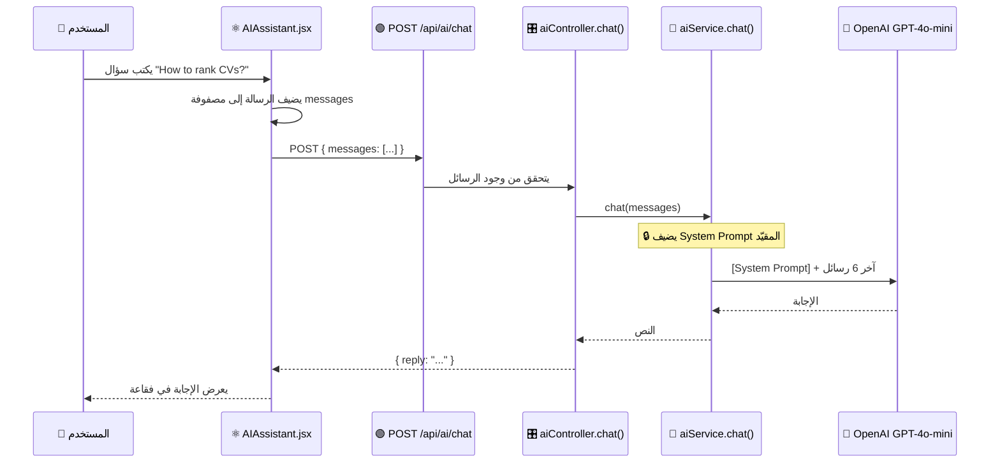

# 🤖 كيف يعمل الشات بوت ولماذا لا يجيب على أسئلة خارج المشروع

## 📁 الملفات المسؤولة

| الملف | الدور |
|-------|-------|
| [aiService.js](file:///c:/Users/ayoub/OneDrive/Desktop/HireX/App/HireX/Backend/services/aiService.js#L148-L178) | دالة `chat()` — ترسل الرسائل إلى OpenAI مع System Prompt |
| [aiController.js](file:///c:/Users/ayoub/OneDrive/Desktop/HireX/App/HireX/Backend/controllers/aiController.js#L397-L410) | نقطة الدخول — يستقبل الرسائل من Frontend |
| [aiRoutes.js](file:///c:/Users/ayoub/OneDrive/Desktop/HireX/App/HireX/Backend/routes/aiRoutes.js#L24) | المسار — `POST /ai/chat` |
| [AIAssistant.jsx](file:///c:/Users/ayoub/OneDrive/Desktop/HireX/App/HireX/src/Screens/AIAssistant.jsx) | واجهة المحادثة الكاملة |

---

## 🔄 مسار المحادثة



---

## 🔒 السر الرئيسي: System Prompt (أمر النظام)

هذا هو **الجزء الأهم** — System Prompt هو الأمر السري الذي يُعطى لـ OpenAI **قبل** أي رسالة من المستخدم:

```javascript
// aiService.js سطر 152-161
const systemPrompt = `You are the HireX AI assistant — strictly limited to 
recruitment, HR, and HireX platform features.

SCOPE: recruitment, candidates, CV analysis, hiring, interviews, 
HR analytics, job positions, dashboard help, application features.

RULES:
- NEVER answer topics outside scope (politics, religion, coding 
  unrelated to HireX, hacking, games, math, science, general knowledge).
- If off-topic, reply ONLY: "I'm specialized only in HireX 
  recruitment features and HR-related assistance."
- Keep answers short, professional, helpful.
- Use markdown bold for key terms.
- Max 3-4 sentences unless detail is requested.`;
```

### 🔍 تفسير كل جزء:

| الجزء | المعنى بالعربي |
|-------|---------------|
| `strictly limited to recruitment, HR` | **مقيّد بشكل صارم** بالتوظيف وإدارة الموارد البشرية فقط |
| `SCOPE:` | **النطاق المسموح**: مرشحين، تحليل CV، مقابلات، وظائف، لوحة التحكم |
| `NEVER answer topics outside scope` | **لا يجيب أبداً** على مواضيع خارج النطاق |
| `politics, religion, coding unrelated to HireX, hacking, games` | **أمثلة ممنوعة**: سياسة، دين، برمجة غير متعلقة، اختراق، ألعاب |
| `If off-topic, reply ONLY:` | **إذا كان السؤال خارج النطاق** يرد برسالة محددة فقط |
| `Max 3-4 sentences` | **إجابات قصيرة** (3-4 جمل) لتوفير التكلفة |

---

## 📱 كيف يعمل Frontend (واجهة المحادثة)

### أ) إرسال الرسالة

```javascript
// AIAssistant.jsx سطر 98-121
const sendMessage = async (text) => {
  const query = text || input.trim();
  if (!query || isTyping) return;

  // 1️⃣ إضافة رسالة المستخدم إلى المصفوفة
  const userMsg = { role: 'user', content: query };
  const updatedMessages = [...messages, userMsg];
  setMessages(updatedMessages);
  setInput('');           // مسح حقل الإدخال
  setIsTyping(true);      // إظهار مؤشر الكتابة ...

  try {
    // 2️⃣ إرسال كل المحادثة إلى Backend
    const res = await aiApi.chat(updatedMessages);
    const reply = res.data?.reply;
    
    // 3️⃣ إضافة رد AI إلى المصفوفة
    setMessages(prev => [...prev, { role: 'assistant', content: reply }]);
  } catch (err) {
    // 4️⃣ في حالة خطأ
    setMessages(prev => [...prev, { 
      role: 'assistant', 
      content: `⚠️ ${errMsg}` 
    }]);
  }
};
```

### ب) اقتراحات جاهزة (Suggestion Chips)

```javascript
// AIAssistant.jsx سطر 21-26
const suggestions = [
  { label: 'Best frontend candidates', prompt: 'Who is the best frontend candidate?' },
  { label: 'How to rank CVs',          prompt: 'How do I use AI to rank candidate CVs?' },
  { label: 'Create a job post',        prompt: 'How can I create and publish a job post on LinkedIn?' },
  { label: 'Interview tips',           prompt: 'What are best practices for conducting interviews?' },
];
```

> [!NOTE]
> عند الضغط على اقتراح، يتم إرسال الـ `prompt` مباشرة كأنه المستخدم كتبه

---

## 🧠 كيف يتم تقليل التكلفة في المحادثة؟

### 1. تقليل عدد الرسائل المرسلة

```javascript
// aiService.js سطر 163-166
const apiMessages = [
  { role: "system", content: systemPrompt },  // دائماً أول رسالة
  ...messages.slice(-6),  // ← فقط آخر 6 رسائل!
];
```

> [!IMPORTANT]
> **`messages.slice(-6)`** يعني أن النظام يرسل فقط **آخر 6 رسائل** من المحادثة إلى OpenAI. هذا يوفر الكثير من التكلفة لأن كل رسالة إضافية = tokens إضافية = تكلفة إضافية.

### 2. تحديد حجم الاستجابة

```javascript
// aiService.js سطر 170
max_tokens: maxTokens,  // 400 token فقط
```

### 3. Temperature منخفضة

```javascript
temperature: 0.5,  // إجابات مركزة ومحددة (ليست إبداعية كثيراً)
```

---

## 🚫 أمثلة على الرفض

| سؤال المستخدم | رد الشات بوت |
|---------------|-------------|
| "ما هي عاصمة فرنسا؟" | ❌ "I'm specialized only in HireX recruitment features and HR-related assistance." |
| "اكتب لي كود Python" | ❌ "I'm specialized only in HireX recruitment features..." |
| "ما رأيك في السياسة؟" | ❌ "I'm specialized only in HireX recruitment features..." |
| "كيف أصنف المرشحين؟" | ✅ يجيب بالتفصيل عن كيفية استخدام ميزة Rank في HireX |
| "What interview questions to ask?" | ✅ يقترح أسئلة مقابلة مهنية |

---

## 🔄 مسار الكنترولر (Backend)

```javascript
// aiController.js سطر 398-410
exports.chat = async (req, res) => {
  try {
    const { messages } = req.body;
    
    // ✅ تحقق من وجود الرسائل
    if (!messages || !Array.isArray(messages) || messages.length === 0) {
      return res.status(400).json({ error: "Messages array is required" });
    }
    
    // 🧠 استدعاء الخدمة
    const reply = await aiService.chat(messages);
    
    // 📤 إرجاع الرد
    return res.json({ reply });
  } catch (error) {
    return res.status(500).json({ error: error.message || "Chat failed" });
  }
};
```

> [!TIP]
> الكنترولر بسيط جداً — كل المنطق الذكي (System Prompt + Token limit) موجود في **aiService.js**

---

## 💡 ملخص — لماذا لا يجيب على أسئلة خارج المشروع؟

```
1. 🔒 System Prompt يحدد النطاق بشكل صارم
2. 📋 قائمة واضحة بالمواضيع الممنوعة
3. 💬 رسالة رفض محددة مسبقاً
4. 🌡️ Temperature = 0.5 (إجابات مركزة)
5. 📏 max_tokens = 400 (إجابات قصيرة)
6. 📦 فقط آخر 6 رسائل (لتوفير السياق والتكلفة)
```

**النتيجة**: الشات بوت يعرف فقط عن التوظيف و HireX، وأي سؤال آخر يرد عليه برسالة ثابتة: *"I'm specialized only in HireX recruitment features and HR-related assistance."*
