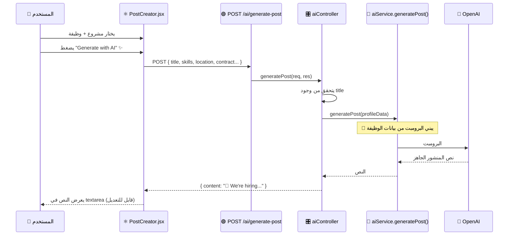

# ✍️ كيف يولّد الذكاء الاصطناعي نص المنشور (LinkedIn Post)

## 📁 الملفات المسؤولة

| الملف | الدور |
|-------|-------|
| [aiService.js](file:///c:/Users/ayoub/OneDrive/Desktop/HireX/App/HireX/Backend/services/aiService.js#L142-L147) | دالة `generatePost()` — البرومبت وإرسال الطلب |
| [aiService.js](file:///c:/Users/ayoub/OneDrive/Desktop/HireX/App/HireX/Backend/services/aiService.js#L127-L133) | دالة `generateJobDescription()` — توليد وصف وظيفي كامل |
| [aiController.js](file:///c:/Users/ayoub/OneDrive/Desktop/HireX/App/HireX/Backend/controllers/aiController.js#L386-L395) | الكنترولر — `generatePost` |
| [aiController.js](file:///c:/Users/ayoub/OneDrive/Desktop/HireX/App/HireX/Backend/controllers/aiController.js#L248-L258) | الكنترولر — `generateDescription` |
| [PostCreator.jsx](file:///c:/Users/ayoub/OneDrive/Desktop/HireX/App/HireX/src/Screens/PostCreator.jsx) | صفحة إنشاء المنشور |
| [JobPosting.jsx](file:///c:/Users/ayoub/OneDrive/Desktop/HireX/App/HireX/src/Screens/Pipeline/JobPosting.jsx) | صفحة النشر داخل Pipeline |

---

## ⚠️ تنبيه مهم: يوجد نوعان مختلفان!

| الميزة | `generatePost` | `generateDescription` |
|--------|---------------|----------------------|
| **الهدف** | نص منشور قصير لـ LinkedIn | وصف وظيفي كامل (Job Description) |
| **الاستخدام** | صفحة **PostCreator** | صفحة **JobPosting** (Pipeline) |
| **النتيجة** | نص عادي (< 800 حرف) | JSON منظم (عنوان + ملخص + مسؤوليات...) |
| **الـ Route** | `POST /ai/generate-post` | `POST /ai/generate-description` |

---

## 🔄 مسار توليد منشور LinkedIn (الرئيسي)



---

## 📝 الخطوة الرئيسية: البرومبت

### توليد منشور LinkedIn (`generatePost`)

```javascript
// aiService.js سطر 143-146
async generatePost(profileData) {
  const prompt = `Write a short LinkedIn job post (<800 chars) for: 
    ${profileData.title}
    ${profileData.technicalSkills ? ". Skills:" + profileData.technicalSkills : ""}
    ${profileData.location ? ". Loc:" + profileData.location : ""}
    ${profileData.typeContract ? ". Type:" + profileData.typeContract : ""}
    
    Return ONLY the post text, no JSON.`;
    
  // ↑ الأمر بسيط ومباشر:
  // "اكتب منشور LinkedIn قصير (أقل من 800 حرف) لهذه الوظيفة"
  // "أرجع النص فقط، بدون JSON"
  
  return await this._call(prompt, 400);  // max 400 tokens
}
```

> [!NOTE]
> لاحظ أن البرومبت يطلب **نص عادي فقط** (بدون JSON)، لأن المنشور يُعرض مباشرة في textarea

### ما البيانات التي يستخدمها AI؟

```javascript
// PostCreator.jsx سطر 88-99 — البيانات المرسلة من Frontend
const res = await aiApi.generatePost({
  title: selectedProfile.title,              // "Full Stack Developer"
  location: selectedProfile.location,         // "Casablanca, Morocco"
  typeContract: selectedProfile.typeContract, // "CDI"
  yearsOfExperience: selectedProfile.yearsOfExperience, // "3"
  education: selectedProfile.education,       // "Master's in CS"
  technicalSkills: selectedProfile.technicalSkills,     // "React, Node.js"
  softSkills: selectedProfile.softSkills,     // "Communication"
  mainMissions: selectedProfile.mainMissions, // "Build web apps"
  description: selectedProfile.description,   // وصف الوظيفة
});
```

---

## 🏗️ توليد وصف وظيفي كامل (`generateDescription`)

هذا مختلف — يولد JSON منظم بأقسام واضحة:

```javascript
// aiService.js سطر 128-133
async generateJobDescription(title, skills, options = {}) {
  const prompt = `Job desc for: ${title}. 
    Skills: ${skills.join(",")}
    ${location ? ". Loc:" + location : ""}
    ${experienceYears ? ". Exp:" + experienceYears + "y" : ""}
    ${contractType ? ". Contract:" + contractType : ""}
    
    Return ONLY JSON: {
      "title": "",
      "summary": "",
      "responsibilities": ["", "", ""],
      "requirements": ["", "", ""],
      "benefits": ["", ""],
      "fullDescription": ""
    }`;
    
  return this._parseJSON(await this._call(prompt, 1000));
}
```

### الفرق في الاستخدام:

```javascript
// JobPosting.jsx سطر 44-70
const handleGenerate = async () => {
  const skills = selectedProfile.technicalSkills
    ?.split(',').map(s => s.trim()).filter(Boolean) || [];
    
  const res = await aiApi.generateDescription({
    title: selectedProfile.title,
    skills,           // ← مصفوفة مهارات
    location: selectedProfile.location,
    experienceYears: selectedProfile.yearsOfExperience,
    contractType: selectedProfile.typeContract,
  });
  
  setAiDescription(res.data.description);
  // ← النتيجة: { title, summary, responsibilities[], requirements[], benefits[] }
};
```

---

## 🔧 الدالة الأساسية `_call` — القلب المشترك

كلتا الدالتين تستخدمان نفس الدالة الأساسية:

```javascript
// aiService.js سطر 10-25
async _call(prompt, maxTokens = 800) {
  if (!process.env.OPENAI_API_KEY) throw new Error("OPENAI_API_KEY missing");
  
  const res = await client.chat.completions.create({
    model: MODEL,  // "gpt-4o-mini"
    messages: [
      { 
        role: "system", 
        content: "You are a concise recruitment AI. Return minimal, compact JSON. No extra whitespace." 
      },
      { role: "user", content: prompt },
    ],
    temperature: 0.4,       // متحفظ
    max_tokens: maxTokens,  // حد الاستجابة
  });
  
  return res.choices?.[0]?.message?.content;
}
```

> [!IMPORTANT]
> **System Prompt** هنا مختلف عن الشات بوت! هنا يقول "أنت AI توظيف مختصر، أرجع JSON مضغوط" — لأن الهدف هو توليد محتوى وليس محادثة.

---

## 📱 كيف يعمل Frontend بعد التوليد

### في PostCreator.jsx:

```
1️⃣ المستخدم يختار مشروع → يختار وظيفة
2️⃣ يضغط "Generate with AI" ✨
3️⃣ النص يظهر في textarea (قابل للتعديل ✏️)
4️⃣ يمكنه تعديل النص يدوياً
5️⃣ يضغط "Publish to LinkedIn" 📤
6️⃣ النص + رابط التقديم يُنشر على LinkedIn
```

### رابط التقديم التلقائي:

```javascript
// PostCreator.jsx سطر 116
text: postBody + (applyLink ? `\n\n👉 Apply: ${applyLink}` : ''),
// يضيف رابط التقديم تلقائياً في نهاية المنشور!
```

---

## 📊 مقارنة بين النوعين

````carousel
### 📝 generatePost — منشور LinkedIn
```
🚀 We're Hiring: Full Stack Developer!

Join our team in Casablanca. We're looking for a 
talented developer with React & Node.js skills.

📍 Casablanca | 💼 CDI | 🎯 3+ years experience

Skills: React, Node.js, PostgreSQL, Docker

Apply now and be part of something great! 🎉

👉 Apply: https://hirex.app/apply/42
```
<!-- slide -->
### 📋 generateDescription — وصف وظيفي كامل
```json
{
  "title": "Full Stack Developer",
  "summary": "We are seeking an experienced...",
  "responsibilities": [
    "Design and build web applications",
    "Write clean, maintainable code",
    "Collaborate with design team"
  ],
  "requirements": [
    "3+ years in React & Node.js",
    "Experience with PostgreSQL",
    "Strong communication skills"
  ],
  "benefits": [
    "Competitive salary",
    "Remote work flexibility"
  ]
}
```
````

---

## 💡 ملخص

```
generatePost (PostCreator.jsx):
  بيانات الوظيفة → برومبت → OpenAI → نص منشور قصير → textarea → نشر LinkedIn

generateDescription (JobPosting.jsx):
  بيانات الوظيفة → برومبت → OpenAI → JSON منظم → عرض أقسام → نشر LinkedIn
```

> [!TIP]
> الفرق الرئيسي: `generatePost` يرجع **نص عادي** جاهز للنشر، بينما `generateDescription` يرجع **JSON منظم** يمكن تعديل كل قسم فيه على حدة
