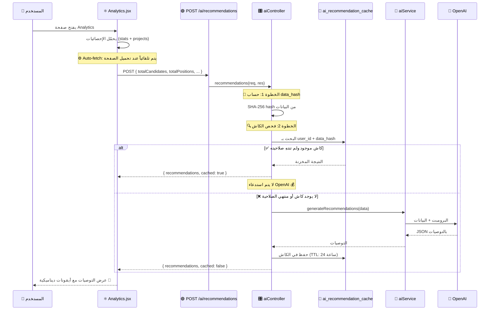

# 📊 كيف تعمل توصيات AI وكيف تتغير الأيقونات

## 📁 الملفات المسؤولة

| الملف | الدور |
|-------|-------|
| [aiService.js](file:///c:/Users/ayoub/OneDrive/Desktop/HireX/App/HireX/Backend/services/aiService.js#L135-L140) | دالة `generateRecommendations()` — البرومبت |
| [aiController.js](file:///c:/Users/ayoub/OneDrive/Desktop/HireX/App/HireX/Backend/controllers/aiController.js#L260-L383) | الكنترولر مع نظام الكاش الذكي |
| [aiRoutes.js](file:///c:/Users/ayoub/OneDrive/Desktop/HireX/App/HireX/Backend/routes/aiRoutes.js#L18) | المسار — `POST /ai/recommendations` |
| [Analytics.jsx](file:///c:/Users/ayoub/OneDrive/Desktop/HireX/App/HireX/src/Screens/Analytics.jsx) | صفحة التحليلات — عرض التوصيات |

---

## 🔄 مسار التنفيذ الكامل



---

## 🧠 ما البيانات التي يحصل عليها AI؟

### البيانات المرسلة من Frontend:

```javascript
// Analytics.jsx سطر 125-138
const buildPayload = () => {
  const totalPositions = projects.reduce(
    (sum, p) => sum + (p.Profiles?.length || 0), 0
  );
  const tc = stats?.totalCandidates || 0;
  
  return {
    totalProjects: stats?.totalProjects || 0,      // عدد المشاريع الكلي
    activeProjects: stats?.activeProjects || 0,     // عدد المشاريع النشطة
    totalCandidates: tc,                             // عدد المرشحين الكلي
    totalPositions,                                  // عدد الوظائف
    screened: Math.round(tc * 0.72),                 // المفحوصين (72%)
    interviewed: Math.round(tc * 0.35),              // من أجري معهم مقابلة (35%)
    offered: Math.round(tc * 0.15),                  // من حصلوا على عرض (15%)
    hired: Math.round(tc * 0.08),                    // الموظفين (8%)
  };
};
```

> [!NOTE]
> النسب (72%, 35%, 15%, 8%) هي **تقديرية** لأن النظام لا يتتبع كل مرحلة بدقة حالياً

---

## 📝 البرومبت — ماذا يطلب AI؟

```javascript
// aiService.js سطر 136-139
async generateRecommendations(data) {
  const prompt = `Give 3 short recruitment tips based on: 
    ${data.totalCandidates || 0} candidates, 
    ${data.totalPositions || 0} positions, 
    ${data.activeProjects || 0} active projects, 
    ${data.screened || 0} screened, 
    ${data.interviewed || 0} interviewed, 
    ${data.hired || 0} hired.
    
    Return ONLY JSON array: [
      {
        "title": "",              // عنوان التوصية
        "description": "",        // شرح مختصر
        "priority": "high|medium|low",  // الأولوية
        "category": "screening|interviews|sourcing|pipeline"  // الفئة
      }
    ]`;
    
  return this._parseJSON(await this._call(prompt, 500));
}
```

### ماذا يعني كل حقل؟

| الحقل | المعنى | التأثير على الواجهة |
|-------|--------|-------------------|
| `title` | عنوان التوصية | النص الرئيسي بالخط العريض |
| `description` | وصف مختصر | النص الرمادي أسفل العنوان |
| `priority` | الأولوية: high, medium, low | **لون الأيقونة + بادج الأولوية** |
| `category` | الفئة: screening, interviews, sourcing, pipeline | **شكل الأيقونة** |

---

## 🎨 كيف تتغير الأيقونات والألوان — الجزء الأهم!

### 1️⃣ تغيير الأيقونة حسب `category`

```javascript
// Analytics.jsx سطر 25-31
const CATEGORY_ICONS = {
  screening:    Zap,         // ⚡ أيقونة البرق (فحص)
  interviews:   Calendar,    // 📅 أيقونة التقويم (مقابلات)
  sourcing:     Search,      // 🔍 أيقونة البحث (مصادر)
  pipeline:     TrendingUp,  // 📈 أيقونة الاتجاه (خط الأنابيب)
  descriptions: Brain,       // 🧠 أيقونة الدماغ (أوصاف)
};
```

### كيف يتم استخدامها:

```javascript
// Analytics.jsx سطر 439
const IconComp = CATEGORY_ICONS[tip.category] || Sparkles;
// ↑ إذا كانت الفئة "screening" → أيقونة ⚡
// ↑ إذا كانت الفئة "interviews" → أيقونة 📅
// ↑ إذا كانت فئة غير معروفة → أيقونة ✨ (افتراضي)
```

### 2️⃣ تغيير لون الأيقونة حسب `priority`

```javascript
// Analytics.jsx سطر 32-36
const PRIORITY_COLORS = {
  high:   'from-rose-500 to-red-600',      // 🔴 أحمر (أولوية عالية)
  medium: 'from-amber-500 to-orange-600',   // 🟡 برتقالي (أولوية متوسطة)
  low:    'from-blue-500 to-cyan-600',      // 🔵 أزرق (أولوية منخفضة)
};
```

### 3️⃣ بادج الأولوية بجانب العنوان

```javascript
// Analytics.jsx سطر 449-453
<span className={`text-[9px] font-bold uppercase ${
  tip.priority === 'high' 
    ? 'text-rose-600 bg-rose-50'      // 🔴 HIGH
    : tip.priority === 'medium' 
    ? 'text-amber-600 bg-amber-50'    // 🟡 MEDIUM
    : 'text-blue-600 bg-blue-50'      // 🔵 LOW
}`}>
  {tip.priority}
</span>
```

---

## 🖼️ كيف يبدو التوصية في الواجهة

```
┌─────────────────────────────────────────────┐
│  [⚡]  Optimize CV Screening Process  HIGH   │ ← أيقونة حمراء (screening + high)
│        Screen candidates faster by...        │
├─────────────────────────────────────────────┤
│  [📅]  Increase Interview Frequency  MEDIUM  │ ← أيقونة برتقالية (interviews + medium)
│        Schedule more interviews to...         │
├─────────────────────────────────────────────┤
│  [🔍]  Expand Sourcing Channels      LOW     │ ← أيقونة زرقاء (sourcing + low)
│        Diversify candidate sources by...      │
└─────────────────────────────────────────────┘
```

### الكود الكامل لعرض توصية واحدة:

```jsx
// Analytics.jsx سطر 438-458
recommendations.map((tip, i) => {
  const IconComp = CATEGORY_ICONS[tip.category] || Sparkles;  // الأيقونة
  const colorGrad = PRIORITY_COLORS[tip.priority] || '...';    // اللون
  
  return (
    <div className="flex items-start gap-3 rounded-xl p-3">
      {/* الأيقونة الملونة */}
      <div className={`w-9 h-9 rounded-xl bg-gradient-to-br ${colorGrad} 
                        flex items-center justify-center`}>
        <IconComp className="w-4 h-4 text-white" />
      </div>
      
      {/* المحتوى */}
      <div>
        <p className="font-semibold">{tip.title}</p>      {/* العنوان */}
        <span className="...">{tip.priority}</span>        {/* البادج */}
        <p className="text-xs">{tip.description}</p>       {/* الوصف */}
      </div>
    </div>
  );
})
```

---

## 💾 نظام الكاش الذكي (Smart Caching)

هذا هو الجزء الأكثر تطوراً في النظام:

### الفكرة الأساسية:

```
البيانات لم تتغير + لم تمر 24 ساعة = لا حاجة لاستدعاء OpenAI
البيانات تغيرت (مرشح جديد مثلاً) = استدعاء OpenAI + تخزين جديد
```

### كيف يعمل؟

#### الخطوة 1: حساب بصمة البيانات (Data Hash)

```javascript
// aiController.js سطر 273-286
function buildDataHash(data) {
  const fingerprint = JSON.stringify({
    totalProjects: data.totalProjects || 0,
    activeProjects: data.activeProjects || 0,
    totalCandidates: data.totalCandidates || 0,
    totalPositions: data.totalPositions || 0,
    screened: data.screened || 0,
    interviewed: data.interviewed || 0,
    offered: data.offered || 0,
    hired: data.hired || 0,
    v: RECOMMENDATION_VERSION,
  });
  return crypto.createHash("sha256").update(fingerprint).digest("hex");
  // مثال: "a3f2b8c9d1e4f5..."
}
```

> [!IMPORTANT]
> أي تغيير في الأرقام (مثلاً مرشح جديد) ينتج **hash مختلف** = التوصيات تُعاد توليدها

#### الخطوة 2: فحص الكاش

```javascript
// aiController.js سطر 305-322
const cached = await ai_recommendation_cache.findOne({
  where: {
    fk_user: userId,          // لكل مستخدم كاش خاص
    data_hash: dataHash,       // نفس بصمة البيانات
    ai_version: RECOMMENDATION_VERSION,  // نفس إصدار AI
  },
});

// هل الكاش صالح؟
if (cached && new Date(cached.ttl_expires_at) > now) {
  // ✅ كاش موجود ولم تنتهِ صلاحيته
  return res.json({
    recommendations: JSON.parse(cached.recommendations),
    cached: true,   // ← Frontend يعرف أنها مخزنة
  });
}
```

#### الخطوة 3: توليد جديد وتخزين

```javascript
// aiController.js سطر 332-358
const recommendations = await aiService.generateRecommendations(data);
const ttlExpiresAt = new Date(now.getTime() + 24 * 60 * 60 * 1000);
// ↑ تنتهي الصلاحية بعد 24 ساعة

// حفظ في قاعدة البيانات
await ai_recommendation_cache.create({
  fk_user: userId,
  data_hash: dataHash,
  recommendations: JSON.stringify(recommendations),
  ai_generated_at: now,
  ttl_expires_at: ttlExpiresAt,
});
```

#### الخطوة 4: تنظيف الكاش القديم

```javascript
// aiController.js سطر 361-370
// احتفظ فقط بآخر 5 كاش لكل مستخدم
const allCaches = await ai_recommendation_cache.findAll({
  where: { fk_user: userId },
  order: [["ai_generated_at", "DESC"]],
});
if (allCaches.length > 5) {
  const toDelete = allCaches.slice(5).map(c => c.id);
  await ai_recommendation_cache.destroy({ where: { id: toDelete } });
}
```

---

## 🔄 زر "Regenerate AI Insights"

```javascript
// Analytics.jsx سطر 141-158
const fetchRecommendations = async (force = false) => {
  const res = await aiApi.recommendations(buildPayload(), force);
  // force = true → يتجاوز الكاش ويطلب من OpenAI مباشرة
  
  setRecommendations(res.data?.recommendations || []);
  setCacheMeta({
    cached: res.data?.cached ?? false,       // هل من الكاش؟
    generatedAt: res.data?.generatedAt,      // متى تم التوليد؟
    expiresAt: res.data?.expiresAt,          // متى تنتهي الصلاحية؟
  });
};
```

### ما يظهر في الواجهة:

```javascript
// Analytics.jsx سطر 386-389
{cacheMeta?.cached
  ? <><CheckCircle /> Cached · generated {date}</>  // ✅ من الكاش
  : 'Powered by OpenAI · data-driven insights'}      // 🤖 جديد
```

---

## 💡 ملخص شامل

```
1️⃣ الصفحة تُحمّل → تحسب إحصائيات (مرشحين، وظائف، مشاريع...)
2️⃣ ترسل الإحصائيات إلى Backend
3️⃣ Backend يحسب hash للبيانات
4️⃣ يبحث في الكاش: هل نفس البيانات مخزنة؟

   ✅ نعم + لم تمر 24h → يرجع النتيجة المخزنة (مجاناً)
   ❌ لا → يطلب من OpenAI 3 توصيات → يخزنها

5️⃣ Frontend يعرض التوصيات:
   - الأيقونة تتغير حسب category (screening=⚡, interviews=📅...)
   - اللون يتغير حسب priority (high=🔴, medium=🟡, low=🔵)
   - البادج يعرض مستوى الأولوية

6️⃣ زر "Regenerate" يتجاوز الكاش ويطلب توصيات جديدة
```
